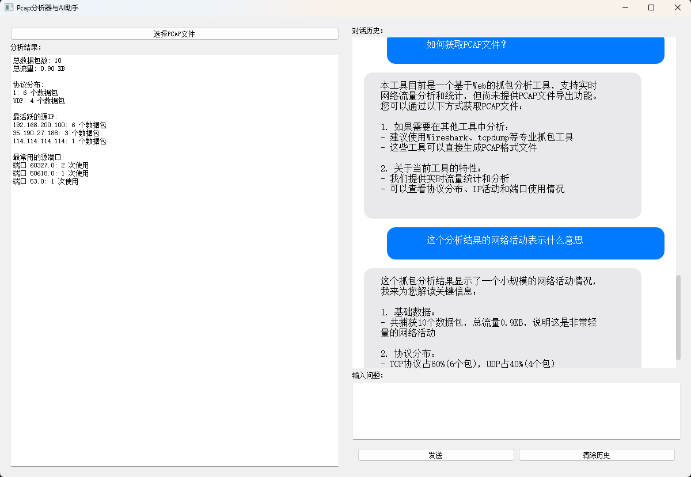

# PCAP文件分析工具

一个基于PyQt5的PCAP文件分析工具，集成了AI助手功能，可以帮助用户更好地理解和分析网络数据包。

## 功能特点

- PCAP文件加载和分析
- 数据包列表显示
- 数据包详情查看
- 数据包过滤
- 统计分析
- AI助手集成，提供智能分析和建议

## 界面预览



## 安装说明

### 方法一：直接下载使用

1. 在项目的 `dist` 目录下找到 `PCAP分析器.exe`
2. 双击运行即可使用，无需安装其他依赖

### 方法二：从源码运行

1. 克隆仓库
```bash
git clone https://github.com/tigerbreak/pcap-analyzer.git
cd pcap-analyzer
```

2. 安装依赖
```bash
pip install -r requirements.txt
```

3. 运行程序
```bash
python main.py
```

## 使用说明

1. 点击"打开文件"按钮选择PCAP文件
2. 等待文件加载完成
3. 使用过滤框输入过滤条件
4. 点击数据包查看详细信息
5. 使用AI助手获取分析建议

## 技术栈

- Python 3.8+
- PyQt5
- Scapy
- Pandas
- DeepSeek API

## 开发计划

- [ ] 添加更多数据包分析功能
- [ ] 优化AI助手响应速度
- [ ] 支持更多文件格式
- [ ] 添加数据导出功能

## 贡献指南

欢迎提交 Issue 和 Pull Request 来帮助改进这个项目。

## 许可证

MIT License 